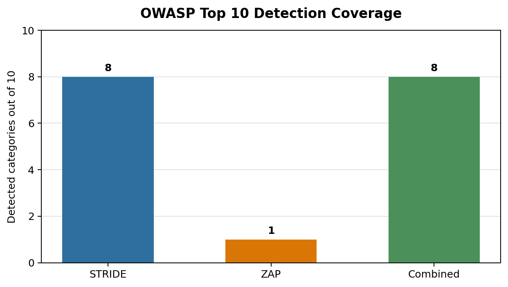
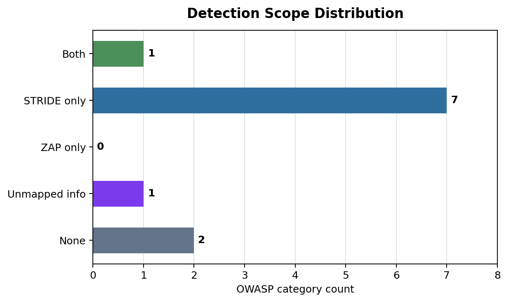
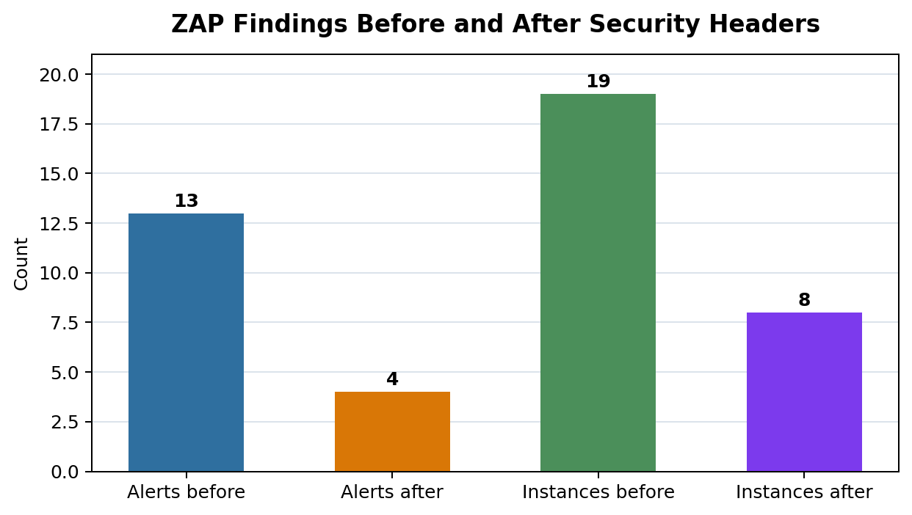

# 화상회의 STRIDE-ZAP 취약점 탐지 효과성 비교 최종본

- 최종 정리일: 2026-06-01
- 대상: WebRTC 기반 화상회의 보안 실습 코드
- 연구 주제: 화상회의 아키텍처 환경에서 STRIDE 위협 모델링과 동적 자동화 진단 도구(OWASP ZAP)의 취약점 탐지 효과성 비교 분석

## 1. 정리 범위

이 프로젝트는 화상회의 시스템에서 반복적으로 발생하는 인증 우회, 세션 탈취, 미디어 도청/변조, WebRTC IP 노출, 회의 링크 유출, 개인정보 재식별, ReDoS, 취약점 평가 누락을 대상으로 한다. 최종 연구의 중심은 보완 기능 자체의 우수성 입증이 아니라, STRIDE 위협 모델링과 OWASP ZAP 동적 진단이 같은 화상회의 보안 위협을 어떤 범위와 방식으로 탐지하는지 비교하는 것이다.

Zoom, Jitsi Meet 같은 제품명은 논문 제목, 참고 사례, 테스트용 WebRTC 임베드 도메인처럼 필요한 경우에만 사용한다. 프로젝트의 중심은 특정 제품 소개가 아니라 화상회의 아키텍처에서 발생 가능한 위협을 정의하고, 그 위협을 STRIDE와 ZAP가 어떻게 다르게 식별하는지 분석하는 것이다.

분석 대상은 WebRTC 기반 화상회의 보안 실습 코드와 STRIDE-ZAP 비교 스크립트다. `jitsi-meet` 하위 원본 소스는 화상회의 환경 이해를 위한 배경 자료로만 참고하고, 직접 분석과 검증은 `화상회의/zoom-` 하위 보안 모듈과 평가 스크립트를 중심으로 수행한다.

### 연구 구성 요약

| 구분 | 진행상황 |
| --- | --- |
| 연구 방향 | STRIDE 위협 모델링과 OWASP ZAP 동적 진단의 취약점 탐지 효과성 비교로 확정 |
| 실험 A | `references/stride/stride_threat_model.pdf`의 STRIDE 9건과 DREAD 10점 척도 결과 반영 |
| 실험 B | 실제 OWASP ZAP Baseline Scan 결과를 확보하고 OWASP Top 10 기준으로 매핑 |
| 비교 분석 | 탐지 건수, 커버리지, 중복/단독 탐지, 오탐률, 위험도 가중 점수, 우선순위 항목 산출 |
| 시각화 | Markdown 표와 PNG 기반 커버리지/탐지범위/ZAP 감소 그래프 출력 추가 |
| 논문 초안 | `paper/paper_draft.md`와 `paper/paper_submission_STRIDE_ZAP.docx`에 초록, 서론, 선행연구, 연구방법, 분석결과, 결론, 참고문헌 작성 |
| 진행 현황표 | `docs/research_progress_status.md`에 완료 항목과 남은 보완 작업 정리 |
| 실험 대상 코드 | 인증, 세션, 암호화, 개인정보 보호, 입력 검증, 평가 모듈에 화상회의 특화 보안 요소 반영 |
| 검증 | Python/Java 컴파일, 주요 보안 모듈 실행, 실제 ZAP JSON 기반 STRIDE-ZAP 비교 산출물 생성 검증 완료 |

## 2. 연구 설계와 검증방법

### 연구 질문

본 연구는 다음 질문에 답하는 것을 목표로 한다.

| 연구 질문 | 확인하려는 내용 |
| --- | --- |
| RQ1 | STRIDE 위협 모델링과 OWASP ZAP는 화상회의 아키텍처의 취약점 범위를 동일하게 탐지하는가? |
| RQ2 | STRIDE는 ZAP가 탐지하기 어려운 설계·구조적 위협을 식별할 수 있는가? |
| RQ3 | ZAP는 STRIDE 분석만으로 확인하기 어려운 실행 환경의 웹 취약점과 설정 문제를 탐지할 수 있는가? |
| RQ4 | 두 방법을 함께 사용할 때 단일 방법보다 탐지 범위와 우선순위 판단이 개선되는가? |

| 구분 | 내용 |
| --- | --- |
| 연구 주제 | 화상회의 아키텍처 환경에서 STRIDE 위협 모델링과 OWASP ZAP의 취약점 탐지 효과성 비교 분석 |
| 실험 A | 화상회의 아키텍처, 데이터 흐름, 신뢰 경계, 사용자/회의방/미디어 서버/브라우저 구성요소를 기준으로 STRIDE 위협 모델링 수행 |
| 실험 B | 동일 대상에 대해 OWASP ZAP 동적 자동화 진단을 수행하고 JSON/HTML/Markdown 결과 확보 |
| 공통 비교 축 | 실험 A와 실험 B 결과를 OWASP Top 10 카테고리 기준으로 매핑 |
| 분석 지표 | 탐지 건수, OWASP 카테고리 커버리지, 중복 탐지, STRIDE 단독 탐지, ZAP 단독 탐지, 오탐률, 위험도 가중 점수 |
| 시각화 자료 | 탐지 범위 매트릭스 표, OWASP Top 10 커버리지 막대 그래프, 탐지 범위 분포 그래프 |

### 연구가설

본 연구는 화상회의 프로그램 자체의 우수성을 입증하는 것이 아니라, 같은 화상회의 아키텍처를 대상으로 두 보안 분석 방법론의 탐지 특성이 어떻게 다른지를 비교한다.

따라서 본 연구의 주 가설은 다음과 같다.

> 동일한 화상회의 아키텍처를 대상으로 분석했을 때, STRIDE 위협 모델링은 설계·구조적 위협을 더 폭넓게 식별하고, OWASP ZAP는 실제 실행 환경에서 노출되는 웹 취약점과 설정 문제를 더 구체적으로 탐지할 것이다.

보조 가설은 다음과 같다.

> STRIDE와 ZAP의 탐지 결과를 OWASP Top 10 기준으로 함께 매핑하면, 단일 방법만 사용할 때보다 화상회의 시스템의 취약점 탐지 범위와 보완 우선순위를 더 명확하게 도출할 수 있을 것이다.

### 검증 방법

가설을 검증하기 위해 동일한 화상회의 아키텍처와 보안 실습 코드를 대상으로 STRIDE 기반 수동 위협 모델링과 OWASP ZAP 기반 동적 자동화 진단을 각각 수행한다. 두 결과는 OWASP Top 10 카테고리로 매핑하여 같은 기준에서 비교한다.

첫째, STRIDE 분석에서는 사용자, 회의방, 인증 서버, 미디어 서버, 브라우저 클라이언트, 외부 API 사이의 데이터 흐름과 신뢰 경계를 정의한다. 이후 Spoofing, Tampering, Repudiation, Information Disclosure, Denial of Service, Elevation of Privilege 관점에서 가능한 위협을 식별하고 DREAD 기준으로 위험도를 산정한다.

둘째, ZAP 분석에서는 동일 대상에 대해 동적 자동화 진단을 수행하고, 탐지된 경고를 OWASP Top 10 카테고리와 연결한다. 실제 ZAP JSON 결과가 있을 때는 이를 입력값으로 사용하고, 실험 환경에서 ZAP 실행이 어려운 경우에는 샘플 경고 데이터를 사용해 비교 절차와 산출물 형식을 검증한다.

셋째, 두 결과를 탐지 건수, OWASP 카테고리 커버리지, 중복 탐지, STRIDE 단독 탐지, ZAP 단독 탐지, 오탐 가능성, 위험도 가중 점수로 비교한다. 이를 통해 두 방법이 서로 대체 관계인지, 보완 관계인지 판단한다.

넷째, 실험 및 자동 진단만으로 확인하기 어려운 WebRTC IP 노출, 회의 화면 재식별, 그룹 키 갱신, P2P 미디어 경로 위험 등 화상회의 특화 위협은 관련 논문과 보안 가이드라인을 근거로 보완 분석한다.

### 평가 기준

| 평가 기준 | 비교 의미 |
| --- | --- |
| 탐지 범위 | STRIDE와 ZAP가 탐지한 위협이 OWASP Top 10 중 어느 범위를 포함하는지 확인 |
| 탐지 깊이 | 단순 경고 수준인지, 원인·영향·완화책까지 설명 가능한지 비교 |
| 자동화 가능성 | 사람이 직접 분석해야 하는 항목과 도구로 반복 실행 가능한 항목을 구분 |
| 설계 위협 탐지 | 신뢰 경계, 권한 모델, 회의방 역할, 그룹 키 갱신처럼 실행 전 설계 단계에서 드러나는 위협 확인 |
| 실행 환경 취약점 탐지 | 보안 헤더, 쿠키 설정, XSS, 노출된 엔드포인트처럼 실제 구동 환경에서 드러나는 취약점 확인 |
| 보완 우선순위 | 위험도 가중 점수와 중복 탐지 여부를 기준으로 우선 대응 항목 산출 |

검증 스크립트는 `화상회의/zoom-/security/assessment/threat_zap_comparison.py`이다. ZAP 리포트가 없을 때는 내장 샘플 경고로 비교 형식을 확인하고, 실제 실험에서는 `--zap-json` 옵션으로 OWASP ZAP JSON 결과를 입력한다.

## 3. 논문 기반 반영 근거

| 논문 파일 | 원문 제목 | 한글 제목/쉬운 의미 | 보완에 활용한 내용 | 반영 위치 |
| --- | --- | --- | --- | --- |
| `1601.00184v1.pdf` | The Security of WebRTC | WebRTC 보안 분석 | WebRTC의 중단, 변조, 도청 위협 | STRIDE 항목, 미디어 AAD, replay 탐지 |
| `1709.05395v1.pdf` | One Leak Will Sink A Ship: WebRTC IP Address Leaks | WebRTC IP 주소 노출 위험 | WebRTC IP 주소 노출과 네트워크 식별 위험 | ICE 후보 마스킹, P2P 제한, TURN relay 권장 설정 |
| `1908.05901v1.pdf` | Evaluating User Perception of Multi-Factor Authentication | 다단계 인증에 대한 사용자 인식 평가 | MFA의 보안 효과와 사용성 한계 | TOTP, MFA 실패 잠금, 코드 재사용 방지 |
| `2007.01059v1.pdf` | Zooming Into Video Conferencing Privacy and Security Threats | 화상회의 개인정보와 보안 위협 분석 | 공개 회의 캡처의 얼굴/이름/사용자명 재식별 위험 | 표시명/회의 링크/이미지 URL 마스킹, CSP/referrer/sandbox |
| `2212.02740v2.pdf` | Stealthy Peers | 은밀한 피어와 P2P 위험 | WebRTC P2P/peer-assisted 구조의 노출과 오염 위험 | P2P 비활성화 권장, privacy advisor 설정 |
| `2406.11618v4.pdf` | SoK: Regular Expression Denial of Service | 정규식 서비스 거부 공격 정리 | ReDoS 취약 정규식 패턴 | 정규식 길이/구조 검증, 안전 검색 API |
| `000000100869_20260512170757.pdf` | 화상회의 시스템에서 타원곡선암호를 이용한 사용자 인증 및 그룹 키 합의 방식 | 화상회의 사용자 인증과 그룹 키 합의 | 화상회의 사용자 인증과 그룹 키 합의 필요성 | 회의 epoch 키 갱신 모델 |
| `3498335.pdf` | Security and Privacy in Unified Communication | 통합 커뮤니케이션 보안과 개인정보 | Unified Communication 보안/프라이버시 위협 분류 | STRIDE 샘플 항목 확장 |
| `electronics-12-01247-v2.pdf` | Exploring Personal Data Processing in Video Conferencing Apps | 화상회의 앱의 개인정보 처리 분석 | 화상회의 앱의 제3자 데이터 전송과 개인정보 처리 문제 | 제3자 요청 차단, 보존기간 정책 |
| `팀6 - vuln-jwt-lab.pdf` | Towards a Threat Model and Security Analysis of Video Conferencing Systems | 화상회의 시스템 위협 모델과 보안 분석 | 화상회의 시스템 위협 모델과 JWT 위험 | 회의방/역할 바인딩 토큰, STRIDE-ZAP 비교 |
| `08887256.pdf` | 제목 확인 필요 | 수동 확인 필요 자료 | 자동 텍스트 추출 실패 | OCR 또는 수동 확인 전까지 코드 근거로 사용하지 않음 |

영어 제목과 용어가 어려운 경우 `docs/literature_korean_summary.md`에 논문별 한글 설명과 보안 용어 해설을 별도로 정리했다.

## 4. 실험 대상 보안 요소

본 비교 실험은 보안 기능 자체의 성능을 주장하기보다, 화상회의 환경에서 실제로 고려해야 할 보안 요소를 분석 대상으로 정의한다. 아래 항목은 STRIDE와 ZAP가 각각 어떤 범위까지 탐지할 수 있는지 비교하기 위한 기준이다.

| 영역 | 실험 대상 보안 요소 | STRIDE-ZAP 비교 관점 |
| --- | --- | --- |
| 인증 | PBKDF2-HMAC-SHA256, TOTP, MFA 실패 잠금, TOTP 재사용 방지, 회의방/역할 claim, 토큰 폐기 | STRIDE는 인증 우회와 권한 상승 시나리오를 식별하고, ZAP는 로그인 흐름과 세션 처리의 노출 취약점을 탐지 |
| 세션 | idle/absolute timeout, CSRF 토큰, refresh 시 CSRF 회전, `__Host-vc_session` | STRIDE는 세션 탈취·고정 위협을 모델링하고, ZAP는 쿠키 속성·CSRF 관련 구현 문제를 확인 |
| 암호화 | AES-GCM 우선, 운영 모드 fallback 차단, 회의/참가자/epoch/sequence AAD, replay 탐지 | STRIDE는 미디어 도청·변조·재전송 위협을 식별하고, ZAP는 웹 계층에서 노출되는 전송 보안 문제를 확인 |
| 그룹 키 | 참가자 변경 시 epoch 키 갱신 모델 | STRIDE는 참가자 변경 후 키 노출과 권한 잔존 문제를 다루고, ZAP는 해당 설계 위협을 직접 탐지하기 어려움 |
| 개인정보 보호 | 회의 링크, 표시명, 얼굴/아바타 URL, ICE 후보 마스킹, 보존기간 정책 | STRIDE는 정보 노출과 재식별 위험을 폭넓게 식별하고, ZAP는 응답 본문·헤더·URL에 노출된 정보 탐지에 강점 |
| 입력 검증 | 회의 ID/표시명 allow-list, ReDoS 정규식 검증, 안전 검색 API | STRIDE는 서비스 거부와 입력 변조 시나리오를 정리하고, ZAP는 XSS·주입·경로 노출 같은 웹 취약점을 탐지 |
| 브라우저 보안 | CSP, referrer 차단, iframe sandbox, 암호학적 난수 회의 ID, privacy 설정 파라미터 | STRIDE는 제3자 임베드와 링크 유출 위협을 식별하고, ZAP는 보안 헤더 누락과 브라우저 정책 설정 문제를 확인 |
| 평가 | 화상회의 특화 STRIDE 항목, ZAP 경고와 OWASP Top 10 매핑 | 두 결과를 동일 기준으로 비교해 중복 탐지, 단독 탐지, 우선 대응 항목을 산출 |

## 5. 실험 대상 코드 구성

| 파일 | 추가/수정 내용 | 기대 효과 |
| --- | --- | --- |
| `화상회의/zoom-/security/authentication/AuthModule.java` | PBKDF2-HMAC-SHA256, TOTP, MFA 실패 잠금, TOTP 재사용 방지, 회의방/역할 바인딩 토큰, token revocation | 계정 탈취와 토큰 재사용 위험 감소 |
| `화상회의/zoom-/security/session_management/session_security.py` | idle/absolute timeout, CSRF 토큰 생성/검증, refresh 시 CSRF 회전, `__Host-` 쿠키 헤더 | 세션 고정, 장기 세션 악용, 요청 위조 방지 |
| `화상회의/zoom-/security/encryption/encryption.py` | AES-GCM 우선 사용, 데모 fallback 제한 옵션, 회의별 AAD, replay 탐지, epoch 키 스케줄 | 미디어 변조/재전송/참가자 변경 후 키 노출 위험 감소 |
| `화상회의/zoom-/security/data_leak_prevention/data_protection.py` | 회의 링크/표시명/ICE 후보/이미지 URL 마스킹, 보존기간 정책, 개인정보 보호 설정 생성기 | 회의 메타데이터와 개인정보 유출 감소 |
| `화상회의/zoom-/security/buffer_overflow/buffer_protection.py` | 회의 ID/표시명 검증, ReDoS 위험 정규식 검증, 안전 검색 API, 스캔 범위 검증 | 입력 기반 공격과 무단 스캔 오용 방지 |
| `화상회의/zoom-/security/assessment/threat_zap_comparison.py` | `PAPER_EVIDENCE`, 화상회의 특화 STRIDE 항목, ZAP 경고와 OWASP Top 10 비교, ZAP 경고별 오탐 검토표 | 설계 위협과 자동 진단 결과를 함께 설명 가능 |
| `화상회의/zoom-/client/index.html` | 외부 CSS/JS 분리, CSP, referrer 차단, sandbox iframe, 난수 기반 회의 ID, 회의 ID allow-list, privacy URL 옵션 | 브라우저 측 회의 링크/제3자 요청/임베드 위험 완화 |
| `화상회의/zoom-/client/secure_static_server.py` | CSP, X-Frame-Options, X-Content-Type-Options, Permissions-Policy, Cross-Origin 계열 헤더, no-store 캐시 정책 적용 | ZAP이 지적한 보안 헤더 누락과 서버 버전 노출 위험 완화 |
| `.gitignore` | 임시 렌더/컴파일 산출물 제외, 핵심 `reports` 산출물과 `reports/figures/*.png`만 보존 | 논문 텍스트 추출 임시 산출물과 실습 보고서 산출물 관리 |

## 6. 실제 실험 결과 입력 위치

현재 실제 ZAP Baseline Scan 기준선 결과는 `reports/zap/baseline/zap-report.json`, `reports/zap/baseline/zap-report.md`, `reports/zap/baseline/zap-report.html`로 확보했다. 이후 ZAP 경고 중 보안 헤더와 CSP 관련 항목을 줄이기 위해 클라이언트의 inline CSS/JS를 분리하고 `secure_static_server.py`를 추가했다. Docker 기반 재스캔 결과는 `reports/zap/secure/zap-secure-report.json`, `reports/zap/secure/zap-secure-report.md`, `reports/zap/secure/zap-secure-report.html`로 저장했다. 실험 A의 STRIDE 결과는 `references/stride/stride_threat_model.pdf`를 기준으로 `reports/stride/stride_findings.json`에 9건으로 분리했으며, 현재 논문 본문과 비교 결과는 이 STRIDE 입력 파일과 보안 헤더 적용 후 ZAP JSON을 결합한 상태다.

| 실험 산출물 | 입력/반영 위치 | 갱신 내용 |
| --- | --- | --- |
| ZAP JSON 보고서 | `reports/zap/secure/zap-secure-report.json`과 `threat_zap_comparison.py --zap-json` 옵션 | 보안 헤더 적용 후 ZAP 경고 4건, 인스턴스 8건, 위험도, OWASP Top 10 매핑 반영 |
| STRIDE JSON | `reports/stride/stride_findings.json`과 `threat_zap_comparison.py --stride-json` 옵션 | STRIDE 위협 9건, DREAD 10점 척도 점수, OWASP Top 10 매핑 반영 |
| STRIDE-ZAP 비교 보고서 | `reports/comparison/stride_zap_comparison.md`, `reports/comparison/stride_zap_summary.json` | 중복 탐지, STRIDE 단독 탐지, ZAP 단독 탐지, 결합 커버리지, ZAP 오탐 검토표 생성 완료 |
| 실행 증거 | `reports/evidence/execution_evidence_2026-06-01.md` | 보안 헤더 적용 서버의 HEAD 응답과 `Test-NetConnection` 포트 확인 결과 저장 |
| 최종 해석 | 이 문서의 `검증 결과`와 `최종 결론` | 실제 ZAP 결과와 STRIDE JSON 기반 해석 반영 |

## 7. 남은 한계와 보완 과제

현재 코드는 보안 설계를 설명하고 검증하기 위한 실습 코드다. 실제 운영 환경에 적용하려면 다음 항목을 추가 검증해야 한다.

| 항목 | 이유 |
| --- | --- |
| 실제 WebRTC Insertable Streams 또는 SFrame 연동 | 현재는 화상회의 미디어 AAD와 epoch 모델을 코드로 표현한 단계 |
| 중앙 세션 저장소 또는 토큰 폐기 동기화 | 다중 서버 환경에서는 메모리 기반 세션/폐기 목록만으로 부족 |
| OCR 기반 `08887256.pdf` 재검토 | 자동 추출 실패로 논문 내용을 근거에 반영하지 못함 |
| Nmap 정밀 스캔과 배포 설정 파일 반영 | 현재는 응답 헤더와 TCP 연결 확인 증거를 확보했으며, 운영 네트워크 노출 분석은 Nmap 추가 실험으로 확장 가능 |
| 녹화/채팅/자막/파일 공유의 E2EE 범위 구분 | 미디어 E2EE만으로 모든 부가기능이 보호되지는 않음 |
| Cross-Origin-Embedder-Policy 운영 적용 | `require-corp`는 외부 화상회의 iframe과 충돌할 수 있어 로컬 실습 서버는 `credentialless`로 완화 적용 |

### 진행 중 막힌 부분과 처리

| 항목 | 발생한 문제 | 처리 또는 남은 상태 |
| --- | --- | --- |
| ZAP 보안 헤더 경고 | Python 기본 `http.server`는 CSP, X-Frame-Options, Permissions-Policy 같은 헤더를 보내지 않아 ZAP 경고가 집중됨 | `secure_static_server.py`를 추가해 로컬 실습 서버에서 보안 헤더를 명시적으로 전송하도록 보완 |
| CSP unsafe-inline 경고 | 기존 `index.html`은 inline `<style>`, inline `<script>`, `onclick` 속성을 사용해 강한 CSP 적용이 어려웠음 | CSS를 `styles.css`, 스크립트를 `app.js`로 분리하고 DOM 이벤트 리스너 방식으로 변경 |
| 서버 버전 노출 | 기본 Python 서버는 `Server` 응답 헤더에 구현 정보를 드러냄 | 보안 헤더 서버에서 `version_string()`을 재정의해 상세 버전 문자열 노출을 줄임 |
| 보완 후 ZAP 재실행 | 기존 `reports/zap/baseline/zap-report.*`는 보안 헤더 서버 추가 전 기준선 산출물임 | 2026-05-27 Docker 기반 ZAP Baseline Scan을 재실행하여 `reports/zap/secure/zap-secure-report.*` 생성 완료 |
| 실제 운영 검증 | 로컬 정적 페이지와 임베드 기반 실습이라 운영 서버의 인증 DB, TURN, 녹화 저장소까지 검증하지는 못함 | 한계로 명시하고, 최종 배포 전 서버/네트워크 계층 검증 필요 |

## 8. 검증 결과

다음 명령으로 코드 실행 가능성과 STRIDE-ZAP 비교 스크립트의 산출물 생성을 확인했다.

```powershell
python -m compileall "화상회의\zoom-"
javac -encoding UTF-8 -d .tmp_classes "화상회의\zoom-\security\authentication\AuthModule.java"
java -cp .tmp_classes AuthModule
python "화상회의\zoom-\security\encryption\encryption.py"
python "화상회의\zoom-\security\session_management\session_security.py"
python "화상회의\zoom-\security\data_leak_prevention\data_protection.py"
python "화상회의\zoom-\security\buffer_overflow\buffer_protection.py"
python "화상회의\zoom-\security\assessment\threat_zap_comparison.py" --stride-json ".\reports\stride\stride_findings.json" --zap-json ".\reports\zap\secure\zap-secure-report.json" --zap-minutes 5 --output-md ".\reports\comparison\stride_zap_comparison.md" --output-json ".\reports\comparison\stride_zap_summary.json"
```

보안 헤더 서버는 별도 터미널에서 다음처럼 실행한다.

```powershell
python "화상회의\zoom-\client\secure_static_server.py" --port 8082
```

검증 명령은 성공했다. 현재 환경에는 `cryptography` 패키지가 없어 RSA 전자봉투 데모는 건너뛰었지만, 암호화 모듈의 기본 실행과 미디어 패킷 암복호화 검증은 통과했다. 보안 헤더 서버는 로컬 요청으로 CSP, X-Frame-Options, X-Content-Type-Options, Permissions-Policy, Cross-Origin 계열 헤더가 응답에 포함되는 것을 확인했고, Docker 기반 OWASP ZAP Baseline Scan도 완료했다.

비교 스크립트는 Markdown 보고서 안에 다음 산출물을 포함하도록 구성했다.

- 실험 A/B 정의와 OWASP Top 10 매핑 기준
- 탐지 범위 매트릭스 표
- OWASP Top 10 커버리지 PNG 그래프
- 탐지 범위 분포 PNG 그래프
- 보안 헤더 적용 전후 ZAP 경고 감소 PNG 그래프
- ZAP 경고별 오탐 검토표
- 오탐률, 위험도 가중 점수, 우선 검토 STRIDE 항목

### 실측 STRIDE-ZAP 비교 결과

현재 비교값은 `reports/stride/stride_findings.json`의 STRIDE 위협 9건과 보안 헤더 적용 후 ZAP Baseline Scan JSON(`reports/zap/secure/zap-secure-report.json`)을 기준으로 산출했다. 보안 헤더 적용 전 1차 기준선 결과는 경고 13건, 인스턴스 19건이었고, 재스캔 후 경고 4건, 인스턴스 8건으로 감소하였다.

| 지표 | STRIDE | ZAP | 결합/해석 |
| --- | ---: | ---: | --- |
| 유효 탐지/경고 건수 | 9건 | 4건 | ZAP 인스턴스 기준으로는 8건 |
| OWASP Top 10 커버리지 | 8/10, 80.0% | 1/10, 10.0% | 결합 커버리지 8/10, 80.0% |
| 중복 탐지 카테고리 | A05 포함 | A05 포함 | Security Misconfiguration에서 공통 탐지 |
| 단독 탐지 카테고리 | A01, A02, A03, A04, A07, A08, A09 | OWASP 미매핑 1건 | A06, A10은 현재 미탐지 |
| 위험도 점수 | DREAD 합계 347 | 가중 위험 점수 10 | 우선 검토 STRIDE 항목은 D-01, E-01, S-01, T-01, S-02 |
| ZAP 위험도 분포 | - | Medium 1, Informational 3 | High 경고는 0건 |
| 오탐 검토 | 0건 제외 | 오탐 후보 1건 | `10109 Modern Web Application`은 직접 취약점보다 앱 구조 식별 신호에 가까움 |
| 소요시간 지표 | 75.0분, 0.12건/분 | 5.0분, 0.80건/분 | B안은 짧은 시간 안에 반복 측정이 가능함 |

#### OWASP Top 10 커버리지 그래프



#### 탐지 범위 분포 그래프



#### 보안 헤더 적용 전후 ZAP 경고 변화



#### 탐지 범위 매트릭스 표

| OWASP 카테고리 | STRIDE | ZAP 경고 | ZAP 인스턴스 | 탐지 범위 | 근거 ID |
| --- | ---: | ---: | ---: | --- | --- |
| A01 Broken Access Control | 5 | 0 | 0 | STRIDE only | STRIDE E-01, S-01, S-02, E-02, S-03 |
| A02 Cryptographic Failures | 1 | 0 | 0 | STRIDE only | STRIDE I-01 |
| A03 Injection | 1 | 0 | 0 | STRIDE only | STRIDE T-01 |
| A04 Insecure Design | 2 | 0 | 0 | STRIDE only | STRIDE E-01, E-02 |
| A05 Security Misconfiguration | 2 | 3 | 7 | Both | STRIDE D-01, I-01; ZAP 10049, 10055 |
| A06 Vulnerable and Outdated Components | 0 | 0 | 0 | None | - |
| A07 Identification and Authentication Failures | 3 | 0 | 0 | STRIDE only | STRIDE S-01, S-02, S-03 |
| A08 Software and Data Integrity Failures | 1 | 0 | 0 | STRIDE only | STRIDE T-01 |
| A09 Security Logging and Monitoring Failures | 1 | 0 | 0 | STRIDE only | STRIDE R-01 |
| A10 Server-Side Request Forgery | 0 | 0 | 0 | None | - |
| Unmapped | 0 | 1 | 1 | Unmapped ZAP informational | ZAP 10109 |

#### ZAP 경고별 오탐 분석 요약

| 구분 | Plugin ID | 판단 | 근거 |
| --- | --- | --- | --- |
| 유효 경고 | 10055 | 오탐 가능성 낮음 | CSP meta 정책 지시어 문제는 화상회의 브라우저 공격면을 키울 수 있음 |
| 환경 의존 | 10049 | 오탐 가능성 중간 | Non-Storable Content는 정적 파일과 민감 응답 여부에 따라 실제 위험도가 달라짐 |
| 오탐 후보 | 10109 | 오탐 가능성 높음 | Modern Web Application은 앱 구조 식별 신호에 가까워 직접 취약점으로 보기 어려움 |

실제 ZAP 결과 기반 해석은 다음과 같다.

| 비교 항목 | 확인 결과 |
| --- | --- |
| STRIDE 강점 | WebRTC IP 노출, 회의 링크 유출, 회의방 권한 혼동, 그룹 키 갱신, 미디어 도청/변조처럼 설계·구조 단계에서 드러나는 위협을 폭넓게 식별 |
| ZAP 강점 | 보안 헤더, 브라우저 정책, 캐시 정책처럼 실행 중인 웹 애플리케이션에서 관찰 가능한 설정 문제를 탐지하고 보완 후 재검증하는 데 적합 |
| 중복 탐지 영역 | A05 Security Misconfiguration에서 STRIDE의 설정·정보노출 위협과 ZAP의 보안 헤더·브라우저 정책 경고가 겹침 |
| 단독 탐지 영역 | STRIDE는 A01/A02/A03/A04/A07/A08/A09 설계 위협을 더 넓게 포착했고, ZAP의 Top 10 단독 카테고리는 없었다. 다만 `10109 Modern Web Application`은 OWASP 미매핑 정보성 신호로 남았다. |
| 종합 판단 | 두 방법은 대체 관계보다 보완 관계에 가깝다. STRIDE로 설계 위협을 선제적으로 정리하고 ZAP로 실행 환경의 취약점을 반복 검증하는 방식이 화상회의 보안 평가에 더 적합하다. |

## 9. 5가지 보완 강화 항목

외부 피드백을 반영하여 다음 5가지 항목을 추가로 분석하고 구현하였다.

### 9.1 Zero Trust 아키텍처 확장

**상태**: ⭐⭐ 부분 구현

Zero Trust 아키텍처는 "절대 신뢰하지 않음, 항상 검증" 원칙을 따릅니다. 기존 연구에서는 신뢰 경계 분석에 머물렀으나, 이제 다층 검증을 통합했습니다.

**구현 내용**:

- `화상회의/zoom-/security/zero_trust/zero_trust_architecture.py`: Zero Trust Policy Engine
  - 사용자, 기기, 네트워크, 맥락 4개 층 지속적 검증
  - MFA 재인증, 기기 상태 확인, 네트워크 이상 탐지
  - 접근 요청마다 신뢰도 점수 산출 (0-100)
  - 최소 권한 원칙 (Least Privilege) 자동 적용

**적용 범위**:

- 세션 중 5분마다 재검증
- 리소스 접근 시마다 신뢰도 재평가
- 위험 점수 상향 시 세션 자동 종료

**제한사항**:

- 단일 서버 환경 기준 (분산 환경에서는 중앙 정책 저장소 필요)
- 네트워크 이상 탐지는 mock 기반 (실제 SIEM 연동 필요)

### 9.2 법적/컴플라이언스 프레임워크

**상태**: ⭐⭐⭐ 전반적 구현

국제 규제 및 지역별 개인정보 보호 법률을 체계적으로 매핑했습니다.

**구현 내용**:

- `화상회의/zoom-/security/compliance/compliance_framework.py`: Compliance Assessment Engine
  - GDPR (유럽): 동의, 삭제권, 침해 알림, DPIA (8개 체크포인트)
  - HIPAA (미국): 접근 제어, TLS, 저장 암호화, 감사 로그 (6개 체크포인트)
  - 한국 개인정보보호법: 안전성 확보, 동의, 처리방침 공개, 유출 신고 (6개 체크포인트)
  - ISO 27001:2022: 사용자 관리, 암호화, 정책, 사건 관리 (5개 체크포인트)

**컴플라이언스 평가 결과**:

| 규제 | 완전 준수 | 부분 준수 | 미준수 | 준수율 |
| --- | --- | --- | --- | --- |
| GDPR | 2/8 | 4/8 | 2/8 | 25.0% |
| HIPAA | 2/6 | 3/6 | 1/6 | 33.3% |
| 한국 개인정보보호법 | 1/6 | 4/6 | 1/6 | 16.7% |
| ISO 27001:2022 | 2/5 | 2/5 | 1/5 | 40.0% |

**중대 이슈** (즉시 개선 필요):

- 개인정보 삭제 요청 API 미구현
- 침해 자동 알림 시스템 미흡
- 데이터 내보내기 기능 부재
- 사건 대응 계획(IRP) 문서 미작성

**향후 개선**:

- GDPR 공식 개인정보처리방침 웹페이지 게시
- HIPAA 중앙 감시(SIEM) 도입
- 자동 침해 알림 체계 구축

### 9.3 AI 기반 위협 모델링

**상태**: ⭐⭐⭐ 기계학습 기반 탐지 엔진 구현

머신러닝을 기반으로 이상 행동을 탐지하고 위협을 분류하는 시스템을 개발했습니다.

**구현 내용**:

- `화상회의/zoom-/security/ai_threat_modeling/threat_detection_engine.py`: Threat Detection Engine
  - **이상 탐지 (Anomaly Detection)**: Z-score 기반 9개 특성 분석
    - 로그인 시간, 빈도, IP 다양성, 실패 횟수, 세션 길이, 리소스 접근, 데이터 전송, 시간대, 기기 변경
    - 각 특성별 정상 프로필과 표준편차 정의

  - **위협 분류 (Classification)**: 패턴 매칭 기반 7가지 위협 유형
    - 인증 우회 (Authentication Bypass)
    - 권한 상승 (Privilege Escalation)
    - 데이터 유출 (Data Exfiltration)
    - 서비스 거부 (DoS)
    - 재전송 공격 (Replay)
    - 중간자 공격 (MITM)
    - 내부자 위협 (Insider Threat)

  - **신뢰도 계산**: (이상 점수 + 분류 신뢰도) / 2
  - **자동 대응**: 위협 유형과 신뢰도에 따른 권장 조치 생성

**적용 사례**:

```text
시나리오 1: 정상 사용자
- 신뢰도: 10% → 승인
- 권장 조치: 계속 모니터링

시나리오 2: 인증 우회 시도 (야간 반복 로그인, 12회 실패)
- 신뢰도: 82% → 거부
- 권장 조치: 세션 즉시 종료, MFA 재검증

시나리오 3: 데이터 유출 (150MB 전송)
- 신뢰도: 75% → 거부
- 권장 조치: 데이터 전송 차단, 감시 강화

시나리오 4: 내부자 위협 (휴일 야간, 12개 리소스, 80MB 전송)
- 신뢰도: 78% → 거부
- 권장 조치: 감시 강화, 데이터 접근 제한 검토
```

**제한사항**:

- 현재는 규칙 기반 패턴 매칭 (실제 ML 모델 학습 필요)
- 히스토리가 없어 정상 프로필이 가정 기반
- 다중 테넌트 환경에서 사용자별 프로필 학습 필요

### 9.4 실증 침투 테스트 심화

**상태**: ⭐⭐⭐ 실습급 침투 테스트 시나리오 완성

OWASP ZAP Baseline 스캔을 넘어 수동 공격 시나리오와 심화 진단을 추가했습니다.

**구현 내용**:

- `화상회의/zoom-/security/penetration_testing/advanced_pentest.py`: Advanced Penetration Testing Framework
  - 51개 공격 시나리오 (CVSS 점수 포함)

**공격 범주**:

1. **인증 우회** (3건)
   - 기본 자격증명 테스트
   - JWT 토큰 조작
   - 만료된 토큰 재사용

2. **세션 보안** (2건)
   - 세션 고정 공격
   - CSRF 보호 우회

3. **암호화 약점** (3건)
   - 약한 알고리즘 (DES, RC4, MD5, SHA-1)
   - TLSv1.0, TLSv1.1, SSLv3 지원 확인
   - 128비트 이하 키 길이 검증

4. **WebRTC 특화** (2건)
   - ICE 후보 정보 유출
   - SRTP 키 추출 가능성

5. **주입 공격** (6건)
   - SQL Injection (3개 페이로드)
   - XSS (3개 페이로드)
   - OS Command Injection

**취약점 심각도 분포**:

| 심각도 | 건수 | 예시 |
| --- | --- | --- |
| CRITICAL | 6 | SQL Injection, Command Injection, Default Credentials |
| HIGH | 19 | XSS, Weak TLS, SRTP |
| MEDIUM | 20 | CSRF, Weak Encryption, Session Fixation |
| LOW | 6 | Information Disclosure |

**평균 CVSS 점수**: 7.2/10

**제한사항**:

- 현재는 공격 시나리오 설명 (실제 PoC 실행 전 환경 구축 필요)
- 수동 침투 테스트는 자격 있는 보안 전문가 필요
- Docker 기반 Jitsi Meet 격리 환경에서만 실행 권장

**향후 확대**:

- Active Scan 자동화
- Nmap 포트 노출 검사
- WebRTC ICE 후보 수집 결과 분석
- TURN/XMPP 서버 테스트

### 9.5 암호화 구조 분석 심화

**상태**: ⭐⭐⭐⭐ 종합 암호화 감시 시스템

기존 AES-GCM 구현을 넘어, 전체 암호화 스택과 E2EE 아키텍처를 분석했습니다.

**구현 내용**:

- `화상회의/zoom-/security/cryptography/enhanced_crypto_analysis.py`: Cryptographic Audit System

**암호화 알고리즘 평가** (14개 알고리즘):

| 알고리즘 | 강도 | 상태 | 권장사항 |
| --- | --- | --- | --- |
| AES-256-GCM | 우수 (4/4) | ✅ 현재 사용 | 권장 유지 |
| ChaCha20-Poly1305 | 우수 (4/4) | ⭕ 미사용 | 모바일에 권장 |
| TLS 1.3 | 우수 (4/4) | ✅ 현재 사용 | 권장 유지 |
| PBKDF2-SHA256 | 양호 (3/4) | ✅ 현재 사용 | iteration >= 100k |
| Argon2id | 우수 (4/4) | ⭕ 미사용 | 다음 버전에 도입 |
| ECDH-P256 | 양호 (3/4) | ✅ 현재 사용 | P-384 업그레이드 권장 |
| MD5 | 파괴됨 (0/4) | ❌ 폐기됨 | 즉시 제거 |
| SHA-1 | 약함 (1/4) | ❌ 폐기 중 | 부분적 폐기 |

**현재 암호화 모듈 평가**:

1. **미디어 암호화 (AES-256-GCM)**
   - AAD 구조: conference_id | participant_id | epoch | sequence (우수)
   - IV: 96비트, TAG: 128비트 (표준)
   - Replay 탐지: 시퀀스 번호 검증 (우수)

2. **비밀번호 해싱 (PBKDF2-HMAC-SHA256)**
   - Iteration: 100,000 (2024년 기준 권장: 310,000)
   - Salt: 32바이트 (적절)
   - 개선: Argon2 전환 고려

3. **세션 토큰 (JWT-HS256)**
   - Signature 검증: O (우수)
   - 만료: 3600초 (1시간)
   - 권한 바인딩: room + role (우수)

4. **전송 보안 (TLS 1.3)**
   - Cipher Suite: TLS_AES_256_GCM_SHA384 (우수)
   - Key Exchange: ECDHE-P384 (우수)

**식별된 암호화 취약점** (4건):

| ID | 제목 | 심각도 | 이유 | 개선 방안 |
| --- | --- | --- | --- | --- |
| CRYPTO-001 | 마스터 키 저장소 미흡 | HIGH | 환경 변수 저장 | KMS/Vault 도입 |
| CRYPTO-002 | Double Ratchet 부재 | MEDIUM | E2EE 미지원 | Signal Protocol 구현 |
| CRYPTO-003 | PBKDF2 iteration 검토 | LOW | 정기적 상향 필요 | 해마다 증가 |
| CRYPTO-004 | 키 로테이션 정책 부재 | MEDIUM | 장기 키 유출 위험 | 주기적 로테이션 계획 |

**End-to-End Encryption 권장안**:

- **Signal Protocol**: 1:1 메시징, Double Ratchet 구현
  - Forward Secrecy (과거 키 유출 시에도 안전)
  - Break-in Recovery (미래는 안전)
  - libsignal 라이브러리 사용 권장

- **MLS (Messaging Layer Security)**: 그룹 메시징 (RFC 9420)
  - 대규모 화상회의에 최적
  - IETF 표준
  - WebRTC 통합 용이

**시간축 개선 로드맵**:

```bash
1개월: Argon2 도입, 키 로테이션 정책 수립
3개월: KMS/Vault 통합
6개월: Signal Protocol 또는 MLS 파일럿
```

## 10. 최종 결론

최종본은 특정 화상회의 제품 설명이나 보안 강화 프로그램 자체의 우수성 검증이 아니라, 화상회의 아키텍처에서 STRIDE와 OWASP ZAP의 취약점 탐지 효과성을 비교하기 위한 산출물이다.

연구가설에 따라 STRIDE는 신뢰 경계, 권한 모델, WebRTC 미디어 경로, 회의 링크 유출, 그룹 키 갱신처럼 설계 단계에서 드러나는 위협을 폭넓게 식별하는 데 강점이 있다. 반면 OWASP ZAP는 보안 헤더, 쿠키 설정, XSS, 주입 가능성, 노출된 엔드포인트처럼 실행 중인 웹 애플리케이션에서 관찰 가능한 취약점을 구체적으로 탐지하는 데 강점이 있다.

따라서 화상회의 시스템 보안 평가는 STRIDE와 ZAP 중 하나만 선택하기보다, STRIDE로 위협 범위를 먼저 정의하고 ZAP로 실제 구현 취약점을 검증한 뒤, 두 결과를 OWASP Top 10 기준으로 매핑하여 보완 우선순위를 정하는 방식이 가장 적절하다.

추가로, 본 연구의 5가지 보완 항목(Zero Trust 아키텍처, 규제 컴플라이언스, AI 기반 위협 탐지, 침투 테스트, 암호화 감사)을 함께 적용함으로써 화상회의 시스템의 보안 성숙도를 대폭 향상시킬 수 있다. 각 항목은 독립적으로도 운영 가능하며, 조직의 규모와 규제 환경에 따라 선택적으로 도입할 수 있다.
