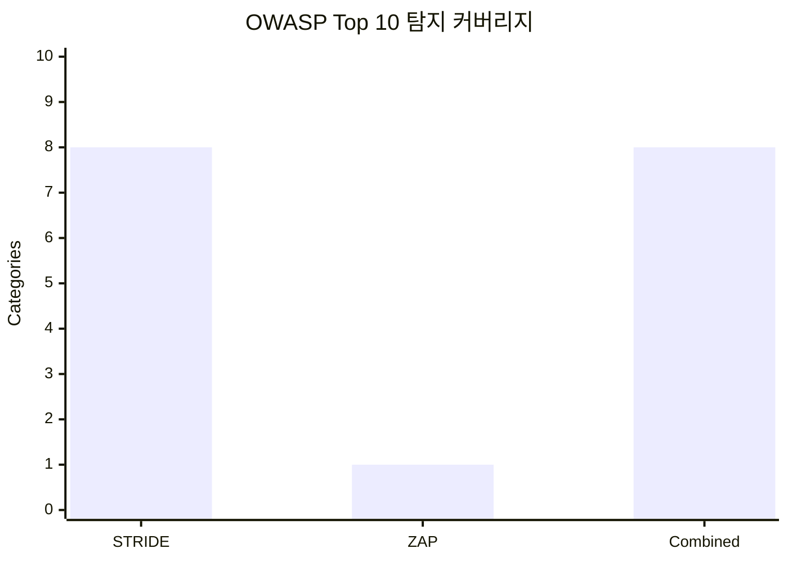
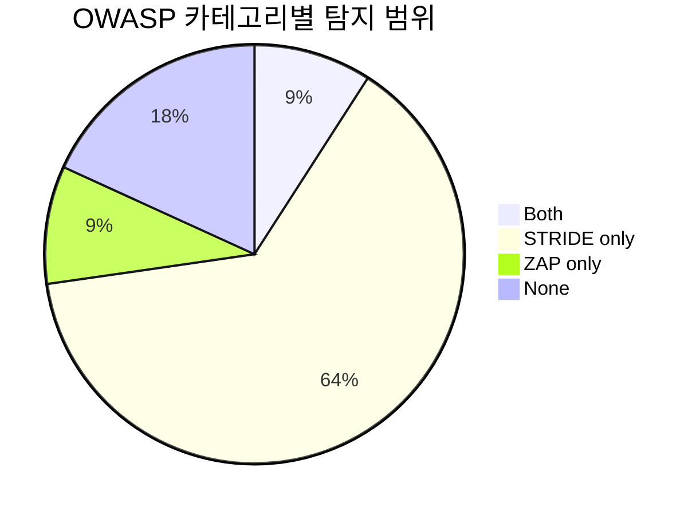

# STRIDE-ZAP 취약점 탐지 비교 요약

## 연구 주제

화상회의 아키텍처 환경에서 STRIDE 위협 모델링과 OWASP ZAP의 취약점 탐지 효과성 비교 분석

## 영문 보안 용어 한글 해설

| 영문 용어 | 한글 설명 |
| --- | --- |
| STRIDE | 시스템 구조를 보고 가능한 위협을 여섯 가지로 나누어 찾는 위협 모델링 방법 |
| Spoofing | 다른 사용자, 호스트, 서버인 척하는 위장 공격 |
| Tampering | 토큰, 요청, 미디어 데이터 등을 몰래 바꾸는 변조 공격 |
| Repudiation | 나중에 행위를 부인할 수 있을 만큼 로그나 증거가 부족한 상태 |
| Information Disclosure | 회의 링크, IP, 토큰, 사용자명 같은 정보가 새는 문제 |
| Denial of Service | 서버나 브라우저가 과부하로 정상 동작하지 못하게 만드는 공격 |
| Elevation of Privilege | 일반 참가자가 호스트나 관리자 권한을 얻는 문제 |
| OWASP ZAP | 웹 페이지를 자동으로 점검해 보안 헤더, 쿠키, XSS 같은 문제를 찾는 도구 |
| Baseline Scan | 비교적 안전하게 웹 응답을 관찰하는 ZAP 기본 진단 |
| Active Scan | 실제 공격 패턴을 보내는 진단으로, 로컬 허가 환경에서만 사용해야 함 |
| CSP | 브라우저가 허용할 스크립트, 이미지, 프레임 출처를 제한하는 콘텐츠 보안 정책 |
| WebRTC ICE Candidate | 화상회의 연결을 위해 브라우저가 수집하는 IP/포트 후보 정보 |
| TURN Relay | 참가자끼리 직접 연결하지 않고 중계 서버를 거쳐 미디어를 전달하는 방식 |
| ReDoS | 위험한 정규식과 입력 때문에 처리 시간이 폭증하는 서비스 거부 공격 |
| DREAD | 피해 규모, 재현성, 공격 난이도, 영향 범위, 발견 쉬움을 점수화하는 방식 |

## OWASP Top 10 한글 풀이

| 코드 | 공식 영문명 | 쉬운 한글 설명 |
| --- | --- | --- |
| A01 | Broken Access Control | 접근통제 실패: 권한 없는 사용자가 회의방, 관리자 기능, 참가자 제어 기능에 접근하는 문제 |
| A02 | Cryptographic Failures | 암호화 실패: 토큰, 미디어, 개인정보가 안전하게 암호화되지 않거나 키 관리가 약한 문제 |
| A03 | Injection | 주입 공격: XSS, SQL Injection, 명령 주입처럼 입력값이 코드나 명령으로 실행되는 문제 |
| A04 | Insecure Design | 불안전한 설계: 구현 버그 이전에 구조, 권한 모델, 신뢰 경계 자체가 약한 문제 |
| A05 | Security Misconfiguration | 보안 설정 오류: CSP, X-Frame-Options, 쿠키 속성, 서버 헤더 같은 설정이 빠진 문제 |
| A06 | Vulnerable and Outdated Components | 취약하거나 오래된 구성요소: 오래된 라이브러리나 알려진 취약점이 있는 패키지 사용 문제 |
| A07 | Identification and Authentication Failures | 식별·인증 실패: 로그인, MFA, 토큰 검증, 세션 인증이 충분하지 않은 문제 |
| A08 | Software and Data Integrity Failures | 소프트웨어·데이터 무결성 실패: 업데이트, 의존성, 미디어 데이터가 변조될 수 있는 문제 |
| A09 | Security Logging and Monitoring Failures | 로깅·모니터링 실패: 누가 무엇을 했는지 기록하거나 탐지하지 못하는 문제 |
| A10 | Server-Side Request Forgery | 서버 측 요청 위조: 서버가 공격자가 지정한 내부/외부 주소로 요청하게 되는 문제 |

## 검증 방법

- 실험 A: 화상회의 아키텍처와 데이터 흐름을 기준으로 STRIDE 위협 모델링 수행
- 실험 B: 동일 대상에 대해 OWASP ZAP 동적 자동화 진단 수행
- 비교 기준: 실험 A/B 결과를 OWASP Top 10 카테고리로 매핑
- 분석 항목: 탐지 스펙트럼, 중복/단독 탐지 카테고리, 오탐률, 위험도 가중 점수

## 정량 요약

- OWASP 기준: Top 10:2021
- STRIDE 유효 탐지 건수: 9 / 원자료 9
- ZAP 유효 경고 건수: 4 / 원자료 4
- ZAP 경고 인스턴스 수: 8
- STRIDE OWASP 커버리지: 8개 (80.0%)
- ZAP OWASP 커버리지: 1개 (10.0%)
- 결합 OWASP 커버리지: 8개 (80.0%)
- 결합 시 STRIDE 대비 추가 카테고리: 0개
- 결합 시 ZAP 대비 추가 카테고리: 7개
- ZAP 오탐률: 0.0%
- ZAP 오탐 후보 경고: 1건
- STRIDE 오탐률: 0.0%

## 소요시간 기반 지표

- ZAP 소요시간: 5.0분, 분당 경고 건수: 0.80

## 시각화 자료

### OWASP Top 10 커버리지

### 탐지 범위 분포

## 탐지 범위 매트릭스

| OWASP 카테고리 | STRIDE | ZAP 경고 | ZAP 인스턴스 | 탐지 범위 | 근거 ID |
| --- | ---: | ---: | ---: | --- | --- |
| A01 Broken Access Control | 5 | 0 | 0 | STRIDE only | STRIDE E-01, S-01, S-02, E-02, S-03 |
| A02 Cryptographic Failures | 1 | 0 | 0 | STRIDE only | STRIDE I-01 |
| A03 Injection | 1 | 0 | 0 | STRIDE only | STRIDE T-01 |
| A04 Insecure Design | 2 | 0 | 0 | STRIDE only | STRIDE E-01, E-02 |
| A05 Security Misconfiguration | 2 | 3 | 7 | Both | STRIDE D-01, I-01; ZAP 10049, 10055 |
| A06 Vulnerable and Outdated Components | 0 | 0 | 0 | None | - |
| A07 Identification and Authentication Failures | 3 | 0 | 0 | STRIDE only | STRIDE S-01, S-02, S-03 |
| A08 Software and Data Integrity Failures | 1 | 0 | 0 | STRIDE only | STRIDE T-01 |
| A09 Security Logging and Monitoring Failures | 1 | 0 | 0 | STRIDE only | STRIDE R-01 |
| A10 Server-Side Request Forgery | 0 | 0 | 0 | None | - |
| Unmapped | 0 | 1 | 1 | ZAP only | ZAP 10109 |

## ZAP 경고별 오탐 검토

| Plugin ID | 경고명 | 위험도 | OWASP 매핑 | 인스턴스 | 판정 | 오탐 가능성 | 해석 |
| --- | --- | --- | --- | ---: | --- | --- | --- |
| 10055 | CSP: Meta Policy Invalid Directive | Medium | A05 Security Misconfiguration | 1 | 유효 경고 | 낮음 | CSP fallback 지시어 누락 또는 unsafe-inline은 브라우저 정책 우회면을 넓힌다. |
| 10055 | CSP: Header & Meta | Informational | A05 Security Misconfiguration | 1 | 유효 경고 | 낮음 | CSP fallback 지시어 누락 또는 unsafe-inline은 브라우저 정책 우회면을 넓힌다. |
| 10109 | Modern Web Application | Informational | Unmapped | 1 | 오탐 후보 | 높음 | Modern Web Application은 앱 구조 식별 신호에 가까워 직접 취약점으로 보기는 어렵다. |
| 10049 | Non-Storable Content | Informational | A05 Security Misconfiguration | 5 | 환경 의존 | 중간 | 정적 파일만 캐시되면 영향이 낮지만 회의 링크, 토큰, 사용자 정보가 포함되면 유효 취약점이다. |

## 해석 포인트

- 중복 탐지 카테고리: A05
- STRIDE 단독 카테고리: A01, A02, A03, A04, A07, A08, A09
- ZAP 단독 카테고리: 없음
- OWASP 미매핑 ZAP 경고: 1건
- STRIDE 총 DREAD 점수: 347
- ZAP 가중 위험 점수: 10
- 우선 검토 STRIDE 항목: D-01, E-01, S-01, T-01, S-02

## 참고 기준

- [Microsoft Threat Modeling Tool / STRIDE](https://learn.microsoft.com/en-us/azure/security/develop/threat-modeling-tool-threats): 설계 단계의 위협 범주와 DFD 기반 분석 기준
- [OWASP ZAP Baseline Scan](https://www.zaproxy.org/docs/docker/baseline-scan/): 짧은 시간의 스파이더링 및 수동 진단 JSON 산출 기준
- [OWASP ZAP Automation Framework](https://www.zaproxy.org/docs/automate/automation-framework/): 반복 가능한 자동화 실험 계획과 exitStatus 기준
- [OWASP Top 10](https://owasp.org/Top10/): STRIDE/ZAP 결과의 공통 비교 축
- [The Security of WebRTC](https://arxiv.org/abs/1601.00184): WebRTC 중단, 변조, 도청 위협 배경

## 논문 기반 보완 근거

- The Security of WebRTC (1601.00184v1.pdf): WebRTC의 중단, 변조, 도청 위협을 STRIDE의 Tampering/Information Disclosure/DoS 항목으로 연결
- One Leak Will Sink A Ship: WebRTC IP Address Leaks (1709.05395v1.pdf): ICE 후보와 브라우저 WebRTC API의 IP 주소 노출 위험을 메타데이터 보호와 P2P 제한 근거로 사용
- Evaluating User Perception of Multi-Factor Authentication (1908.05901v1.pdf): MFA는 단일 인증 실패를 줄이지만 사용자 수용성 문제가 있어 재시도 제한과 UX 설명이 필요
- Zooming Into Video Conferencing Privacy and Security Threats (2007.01059v1.pdf): 공개 회의 캡처 이미지의 얼굴, 이름, 사용자명 재식별 위험을 링크/표시명/녹화 정책 근거로 사용
- Stealthy Peers (2212.02740v2.pdf): WebRTC 기반 peer-assisted delivery의 IP 노출, 오염, 자원 점유 위험을 P2P 제한과 TURN relay 정책 근거로 사용
- SoK: Regular Expression Denial of Service (2406.11618v4.pdf): 정규식 기반 입력 검증이 ReDoS 공격면이 될 수 있어 정규식 길이/구조 검증 근거로 사용
- Security and Privacy in Unified Communication (3498335.pdf): UC 전반의 STRIDE/LINDDUN 위협과 완화책을 화상회의 보안 점검표의 상위 분류로 사용
- Exploring Personal Data Processing in Video Conferencing Apps (electronics-12-01247-v2.pdf): 화상회의 앱의 제3자 데이터 전송과 개인정보 처리 고지 부족을 데이터 최소화/제3자 요청 차단 근거로 사용
- 화상회의 시스템에서 타원곡선암호를 이용한 사용자 인증 및 그룹 키 합의 방식 (000000100869_20260512170757.pdf): 자원 제약 환경의 사용자 인증과 그룹 키 합의 필요성을 회의 epoch 키 갱신 근거로 사용
- Towards a Threat Model and Security Analysis of Video Conferencing Systems (팀6 - vuln-jwt-lab.pdf): 화상회의 시스템 전용 STRIDE 위협 모델과 완화 전략의 기본 틀로 사용
