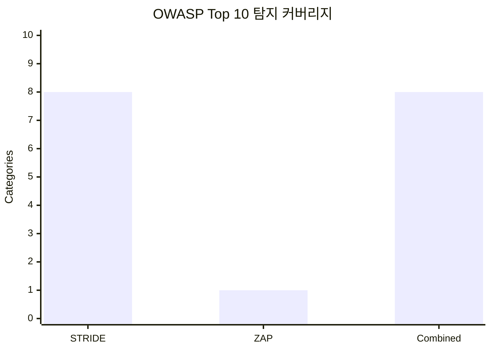
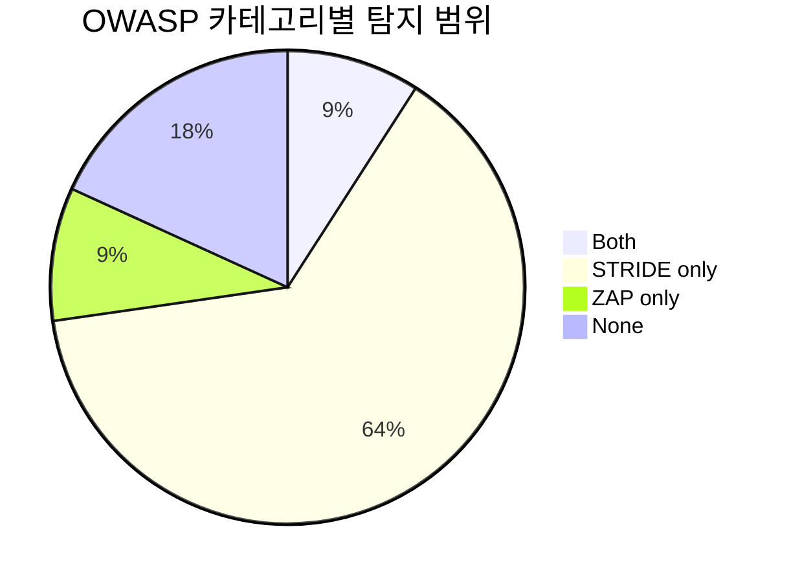

# STRIDE-ZAP 취약점 탐지 비교 요약

## 연구 주제

화상회의 아키텍처 환경에서 STRIDE 위협 모델링과 OWASP ZAP의 취약점 탐지 효과성 비교 분석

## 검증 방법

- 실험 A: 화상회의 아키텍처와 데이터 흐름을 기준으로 STRIDE 위협 모델링 수행
- 실험 B: 동일 대상에 대해 OWASP ZAP 동적 자동화 진단 수행
- 비교 기준: 실험 A/B 결과를 OWASP Top 10 카테고리로 매핑
- 분석 항목: 탐지 스펙트럼, 중복/단독 탐지 카테고리, 오탐률, 위험도 가중 점수

## 정량 요약

- OWASP 기준: Top 10:2021
- STRIDE 유효 탐지 건수: 12 / 원자료 12
- ZAP 유효 경고 건수: 13 / 원자료 13
- ZAP 경고 인스턴스 수: 19
- STRIDE OWASP 커버리지: 8개 (80.0%)
- ZAP OWASP 커버리지: 1개 (10.0%)
- 결합 OWASP 커버리지: 8개 (80.0%)
- 결합 시 STRIDE 대비 추가 카테고리: 0개
- 결합 시 ZAP 대비 추가 카테고리: 7개
- ZAP 오탐률: 0.0%
- STRIDE 오탐률: 0.0%

## 소요시간 기반 지표

- ZAP 소요시간: 5.0분, 분당 경고 건수: 2.60

## 시각화 자료

### OWASP Top 10 커버리지

### 탐지 범위 분포

## 탐지 범위 매트릭스

| OWASP 카테고리 | STRIDE | ZAP 경고 | ZAP 인스턴스 | 탐지 범위 | 근거 ID |
| --- | ---: | ---: | ---: | --- | --- |
| A01 Broken Access Control | 3 | 0 | 0 | STRIDE only | STRIDE S-01, E-01, S-02 |
| A02 Cryptographic Failures | 4 | 0 | 0 | STRIDE only | STRIDE I-01, I-02, I-03, I-04 |
| A03 Injection | 2 | 0 | 0 | STRIDE only | STRIDE T-01, T-02 |
| A04 Insecure Design | 1 | 0 | 0 | STRIDE only | STRIDE E-01 |
| A05 Security Misconfiguration | 6 | 8 | 12 | Both | STRIDE I-01, D-01, I-02, I-03, I-04, D-02; ZAP 10020, 10021, 10036, 10038, 10049, 10055 |
| A06 Vulnerable and Outdated Components | 0 | 0 | 0 | None | - |
| A07 Identification and Authentication Failures | 2 | 0 | 0 | STRIDE only | STRIDE S-01, S-02 |
| A08 Software and Data Integrity Failures | 2 | 0 | 0 | STRIDE only | STRIDE T-01, T-02 |
| A09 Security Logging and Monitoring Failures | 1 | 0 | 0 | STRIDE only | STRIDE R-01 |
| A10 Server-Side Request Forgery | 0 | 0 | 0 | None | - |
| Unmapped | 0 | 5 | 7 | ZAP only | ZAP 10063, 10109, 90004 |

## 해석 포인트

- 중복 탐지 카테고리: A05
- STRIDE 단독 카테고리: A01, A02, A03, A04, A07, A08, A09
- ZAP 단독 카테고리: 없음
- OWASP 미매핑 ZAP 경고: 5건
- STRIDE 총 DREAD 점수: 215
- ZAP 가중 위험 점수: 39
- 우선 검토 STRIDE 항목: D-01, I-03, S-01, I-01, I-02

## 참고 기준

- Microsoft Threat Modeling Tool / STRIDE: 설계 단계의 위협 범주와 DFD 기반 분석 기준 (<https://learn.microsoft.com/en-us/azure/security/develop/threat-modeling-tool-threats>)
- OWASP ZAP Baseline Scan: 짧은 시간의 스파이더링 및 수동 진단 JSON 산출 기준 (<https://www.zaproxy.org/docs/docker/baseline-scan/>)
- OWASP ZAP Automation Framework: 반복 가능한 자동화 실험 계획과 exitStatus 기준 (<https://www.zaproxy.org/docs/automate/automation-framework/>)
- OWASP Top 10: STRIDE/ZAP 결과의 공통 비교 축 (<https://owasp.org/Top10/>)
- The Security of WebRTC: WebRTC 중단, 변조, 도청 위협 배경 (<https://arxiv.org/abs/1601.00184>)

## 논문 기반 보완 근거

- The Security of WebRTC (1601.00184v1.pdf): WebRTC의 중단, 변조, 도청 위협을 STRIDE의 Tampering/Information Disclosure/DoS 항목으로 연결
- One Leak Will Sink A Ship: WebRTC IP Address Leaks (1709.05395v1.pdf): ICE 후보와 브라우저 WebRTC API의 IP 주소 노출 위험을 메타데이터 보호와 P2P 제한 근거로 사용
- Evaluating User Perception of Multi-Factor Authentication (1908.05901v1.pdf): MFA는 단일 인증 실패를 줄이지만 사용자 수용성 문제가 있어 재시도 제한과 UX 설명이 필요
- Zooming Into Video Conferencing Privacy and Security Threats (2007.01059v1.pdf): 공개 회의 캡처 이미지의 얼굴, 이름, 사용자명 재식별 위험을 링크/표시명/녹화 정책 근거로 사용
- Stealthy Peers (2212.02740v2.pdf): WebRTC 기반 peer-assisted delivery의 IP 노출, 오염, 자원 점유 위험을 P2P 제한과 TURN relay 정책 근거로 사용
- SoK: Regular Expression Denial of Service (2406.11618v4.pdf): 정규식 기반 입력 검증이 ReDoS 공격면이 될 수 있어 정규식 길이/구조 검증 근거로 사용
- Security and Privacy in Unified Communication (3498335.pdf): UC 전반의 STRIDE/LINDDUN 위협과 완화책을 화상회의 보안 점검표의 상위 분류로 사용
- Exploring Personal Data Processing in Video Conferencing Apps (electronics-12-01247-v2.pdf): 화상회의 앱의 제3자 데이터 전송과 개인정보 처리 고지 부족을 데이터 최소화/제3자 요청 차단 근거로 사용
- 화상회의 시스템에서 타원곡선암호를 이용한 사용자 인증 및 그룹 키 합의 방식 (000000100869_20260512170757.pdf): 자원 제약 환경의 사용자 인증과 그룹 키 합의 필요성을 회의 epoch 키 갱신 근거로 사용
- Towards a Threat Model and Security Analysis of Video Conferencing Systems (팀6 - vuln-jwt-lab.pdf): 화상회의 시스템 전용 STRIDE 위협 모델과 완화 전략의 기본 틀로 사용
